# SatQuery

Natural-language querying of satellite imagery, with every answer backed by inspectable evidence and an execution trace.

**Why this exists:** satellite analysis today means an expert driving desktop GIS software through optical, SAR, and multi-temporal imagery by hand. SatQuery lets someone ask *"What changed between these two observations?"* or *"Where is the largest ship?"* and get back not just an answer, but the change mask, bounding boxes, verification checks, confidence reasoning, and provenance needed to trust it.

## Key features

- **Unified query endpoint** (`POST /analyze`): routes a text query + images to the right specialist (VQA, grounding, temporal change, optical+SAR representation, scene ranking) and returns one normalized response schema.
- **Agentic investigator** (`POST /investigate`): decomposes a mission into a typed plan, checks it against a deterministic policy layer, and executes it with bounded observe-and-replan steps (early stop, structured replans, no fabricated outputs).
- **Specialist models, CPU-only:** visual QA (TinyRS-2B), referring grounding + masks (RemoteSAM), bi-temporal change masks (ChangeFormer), optical+SAR joint representations (CROMA, DOFA fallback), zero-shot scene ranking (RemoteCLIP).
- **Evidence engine:** typed evidence items, deterministic verification (`SUPPORTED / CONTRADICTED / INSUFFICIENT_EVIDENCE / NOT_APPLICABLE`), evidence-derived confidence categories (never a number), and full provenance per result.
- **Geospatial safety:** GeoTIFF validation plus a co-registration gate — misregistered pairs are refused with a structured reason, never silently resampled. SAR is never treated as RGB.
- **Report export:** investigation results export to HTML (`POST /investigate/report`) and GeoJSON (EPSG:4326); the investigator also burns a PNG overlay preview (post-event optical + change tint + grounding box).
- **Zero-build local UI:** `GET /` serves a single self-contained page (no npm build, no CDN) with ASK and INVESTIGATE workspaces, a spatial viewer, and evidence panels.

## Architecture overview

```mermaid
flowchart LR
    UI["Single-file UI"]
    API["FastAPI: analyze, investigate, scene, change"]
    ING["ingestion + metadata"]
    GEO["geospatial gate: validate + co-register"]
    BLOCKED["BLOCKED + reason"]
    ROUTE["deterministic router and planner"]
    POL["policy layer: 12 checks"]
    EXEC["bounded executor: max 8 specialist calls"]
    MODELS["TinyRS, RemoteSAM, ChangeFormer, RemoteCLIP, CROMA, DOFA"]
    VER["verification"]
    EV["evidence + confidence + provenance"]
    OUT["NormalizedResponse: JSON, HTML report, GeoJSON"]

    UI --> API
    API --> ING
    ING --> GEO
    GEO --> BLOCKED
    GEO --> ROUTE
    ROUTE --> POL
    POL --> EXEC
    EXEC --> MODELS
    MODELS --> VER
    VER --> EV
    EV --> OUT
```



See [`docs/ARCHITECTURE.md`](docs/ARCHITECTURE.md) for the module-by-module walkthrough.

## Tech stack

Only what the code actually uses:

| Layer | Technology |
|---|---|
| API | Python 3.11, FastAPI, Uvicorn, Pydantic v2, structlog |
| Geospatial | Rasterio/GDAL, Shapely, pyproj, NumPy, SciPy, Pillow |
| Models | PyTorch (CPU), Transformers, open-clip-torch — each in its own isolated venv, called via subprocess |
| Web UI | Single-file HTML/JS served by the backend (no framework, no CDN) |
| React app | `apps/frontend` is a dependency manifest only (see Limitations) |
| Supporting services | PostGIS, Redis, MinIO via Docker Compose (declared, not yet connected — see Limitations) |
| Tests/lint | pytest (markers: `slow`, `gpu`, `integration`), ruff + black |

No LangChain/LangGraph/agent framework: orchestration is hand-written deterministic code (`RuleBasedPlanner` → policy checks → bounded executor). An LLM appears only in two opt-in paths (a local planner and a hybrid intent extractor), always behind repair, cross-checks, and deterministic fallback.

## Getting started

### Prerequisites

- Python 3.11+, `git`, ~12 GB free disk for model checkpoints, 8 GB+ RAM. CPU-only is supported; no GPU required.
- Model checkpoint files placed under `models/cache/` (see `scripts/download_models/`; that directory is gitignored).
- Docker (optional, for supporting services only).

### Install

```bash
cp .env.example .env
make setup                    # editable-installs packages + backend + frontend deps (not run here)
```

Per-package alternative (verified working on this machine):

```bash
python -m pip install -e packages/core -e packages/geospatial -e packages/agents \
  -e packages/evidence -e packages/model_adapters -e apps/backend
```

### Configure

Environment variables are listed in [`.env.example`](.env.example) — data directory, per-model checkpoint overrides, and planner selection (`SATQUERY_PLANNER=rule` by default; `llm` and `hybrid` are opt-in).

### Run

```bash
make dev-backend              # uvicorn -> http://127.0.0.1:8000/ (declared in Makefile, not run here)
```

Direct equivalent (verified: app imports, `/health` returns 200):

```bash
cd apps/backend && uvicorn app.main:app --host 127.0.0.1 --port 8000
# UI:      http://127.0.0.1:8000/
# OpenAPI: http://127.0.0.1:8000/docs
```

Full stack via Docker (not run here): `docker compose up --build` (API :8000, frontend :5173, PostGIS :5432, Redis :6379, MinIO :9000/9001).

### Test

```bash
.venvs/satquery/Scripts/python.exe -m pytest packages apps/backend/tests -q -m "not slow and not gpu and not integration"
# verified: 437 passed, 38 deselected (slow/gpu/integration) in ~90s
```

`make test-frontend` and `make lint` were not run here (frontend has no installed deps; ruff/black not installed in the venv).

## Usage examples

Health check (verified live):

```bash
curl http://127.0.0.1:8000/health
# {"status":"ok"}
```

The following follow the API contract in code (not live-run with model checkpoints here):

```bash
# Zero-shot scene ranking over candidate labels
curl -X POST http://127.0.0.1:8000/scene \
  -H 'Content-Type: application/json' \
  -d '{"image_path": "data/demo/scene/airport.jpg",
       "prompts": ["airport", "forest", "harbor"]}'

# Bi-temporal change mask (T1/T2 must be co-registered; otherwise refused)
curl -X POST http://127.0.0.1:8000/change \
  -H 'Content-Type: application/json' \
  -d '{"t1_path": "data/demo/investigation/t1_optical.tif",
       "t2_path": "data/demo/investigation/t2_optical.tif"}'

# Unified natural-language query
curl -X POST http://127.0.0.1:8000/analyze \
  -H 'Content-Type: application/json' \
  -d '{"query": "What objects are visible in this satellite image?",
       "image_paths": ["data/demo/vqa/scene.jpg"]}'

# Agentic multi-step investigation (+ HTML report at /investigate/report)
curl -X POST http://127.0.0.1:8000/investigate \
  -H 'Content-Type: application/json' \
  -d '{"mission": "Identify significant changes between the two observations
        and locate the affected structures.",
       "image_paths": ["data/demo/investigation/t1_optical.tif",
                       "data/demo/investigation/t2_optical.tif",
                       "data/demo/investigation/s2_dfc_optical.tif",
                       "data/demo/investigation/s1_dfc_sar.tif"]}'
```

In the UI: open `http://127.0.0.1:8000/`, upload one image for ASK or the four investigation tiles for INVESTIGATE, type a query, and inspect the plan, spatial viewer, findings, confidence, verification, and evidence panels.

<!-- TODO: add screenshot of ASK result with evidence panel -->
<!-- TODO: add screenshot of INVESTIGATE workspace (plan + map + findings) -->
<!-- TODO: add GIF of upload → analyze → evidence flow (~60s) -->

## Project structure

```
apps/backend/app/      FastAPI app: api/ (endpoints), services/ (slices per task), static/index.html (UI)
apps/frontend/         React manifest only — no source yet (see Limitations)
packages/core/         Pipeline spine + contracts: routing, planning, registry, fusion, confidence, reports
packages/geospatial/   Raster/vector I/O, validation, co-registration gate
packages/agents/       Deterministic orchestration: typed plans, policy layer, planners, repair
packages/evidence/     Evidence items, deterministic verifier, provenance, semantic checks
packages/model_adapters/ Specialist adapters + model_registry.yaml (routing reads only this file)
external/research/     Vendored reference repos — read-only, gitignored, never imported
models/cache|checkpoints/  Weights (gitignored)       data/demo/  Small tracked demo tiles
evaluation/            Datasets, frozen missions, eval scripts, reports
scripts/               Setup, model/data downloaders, demo runners
docs/                  Numbered design docs, decision log (DECISIONS.md), live status (PROJECT_STATUS.md)
```

## Design decisions and tradeoffs

1. **Deterministic orchestration by default, LLM strictly opt-in.** The rule-based planner + policy layer is the production path because the measured local-LLM planner echoed its prompt example instead of planning. This trades open-ended flexibility for auditability: every plan step comes from a closed task/tool ontology. Cost: novel mission phrasings only get keyword-level understanding.
2. **One subprocess per specialist call.** Each model lives in its own conflicting venv (torch versions, mmcv, transformers all disagree) and is loaded lazily per request, so nothing stays resident and environments can't clash. Cost: cold-start latency (seconds to over a minute on CPU).
3. **Rule-over-registry routing.** `model_registry.yaml` holds measured facts (latency, params, license, evidence level) and routing reads only that file — no hardcoded model names, no paper-claim capabilities. Cost: adding a model means writing an adapter plus registry entry, not a one-liner.
4. **Refuse instead of resample.** Misregistered image pairs return a structured BLOCKED result rather than being silently warped into alignment, because a fabricated alignment would corrupt every downstream measurement (area, centroid, change fraction). Cost: users must supply co-registered inputs.
5. **Confidence as a category, never a number.** `HIGH / MEDIUM / LOW / INSUFFICIENT_EVIDENCE` derived from evidence rules (multi-specialist agreement, verification status, failure presence). Raw model scores are surfaced with an explicit "relative, not calibrated" meaning. Cost: no probabilistic ranking or thresholding downstream.

## Limitations and known issues

- Evaluation is sanity-scale (tens to hundreds of samples per experiment); no statistical significance established for any model comparison.
- The React frontend (`apps/frontend`) has no source files and no Vite config — only `package.json`. `npm run dev/build/test` cannot work; the working UI is the backend-served single file.
- PostGIS/Redis/MinIO appear in Docker Compose and the example env file, but the app never connects to them (`lifespan` in `main.py` carries TODOs for DB pool, object storage, and model warm-up).
- The optical+SAR task benefit did not survive a larger data split (sign flipped), so no "SAR improves results" claim is made; the joint representation remains integrated.
- The pure local-LLM planner is rejected for production use; the hybrid intent planner is opt-in and does not beat the deterministic planner on CPU hardware.
- GPU fit is unverified (CPU-only host); no VRAM figure is claimed.
- One checkpoint license is not stated upstream, so that grounding component ships as optional — the rest works without it.
- Semantic-change descriptions are an experimental composed baseline (mask regions + zero-shot tags), not a learned temporal vision-language model; tags are noisy on small crops.
- No CI configuration exists in the repo.

## Roadmap

Only items grounded in code TODOs:

- Wire the application lifespan (`apps/backend/app/main.py` TODOs): warm the model registry at startup, open the database pool, connect object storage, and add graceful shutdown.
- TODO: confirm — whether the React frontend should be implemented, removed, or kept as a manifest for a future client.

## Contributing

Read [`AGENTS.md`](AGENTS.md) and [`CLAUDE.md`](CLAUDE.md) before changing code. Record notable choices in [`docs/DECISIONS.md`](docs/DECISIONS.md). License: MIT (see `LICENSE`; vendored research code keeps its upstream licenses).
